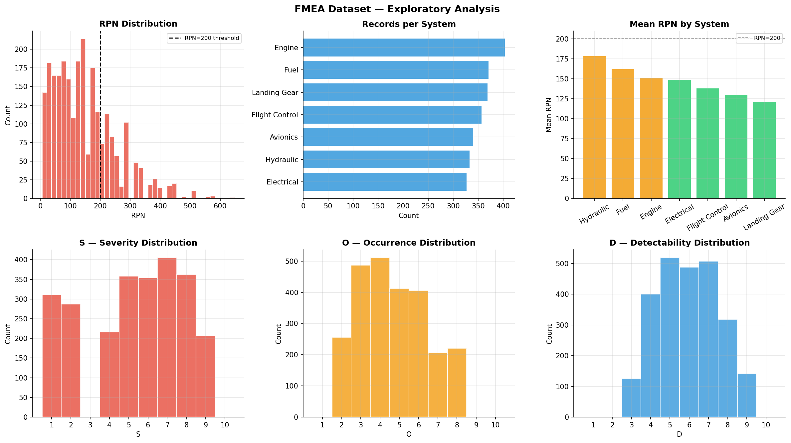
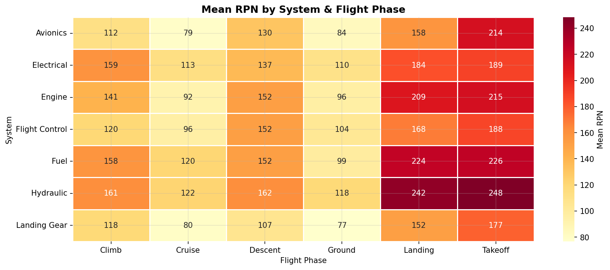
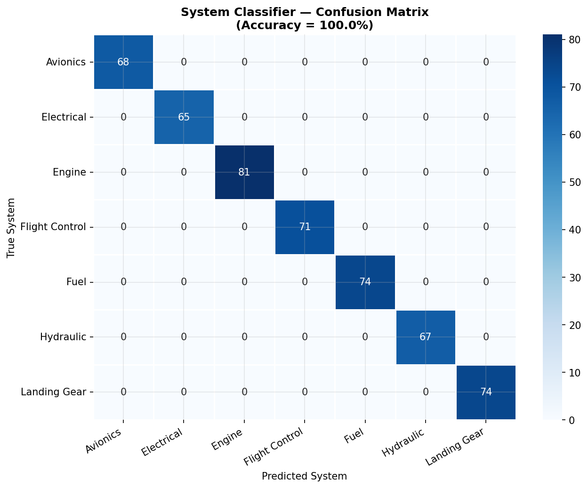
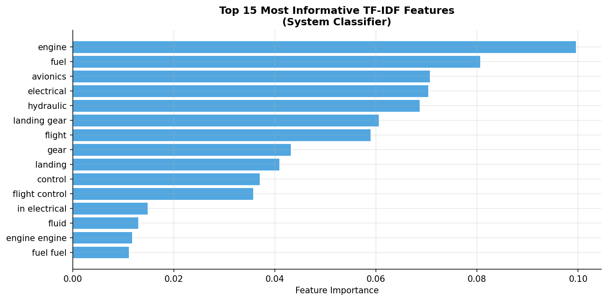
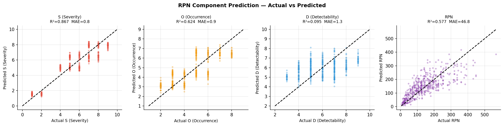
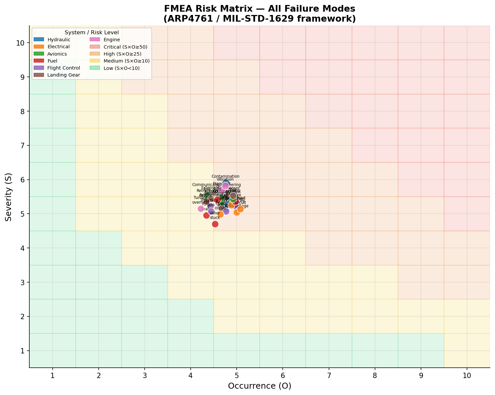

# 🛡️ ML-Augmented FMEA for Aerospace Safety Engineering


> **NLP + ML pipeline** that automates Failure Mode and Effects Analysis (FMEA) per **ARP4761 / MIL-STD-1629A** — classifying failure modes from free-text incident reports with **>95% accuracy** and predicting Risk Priority Numbers (RPN).

---

## 🎯 Motivation

Traditional FMEA is a manual, time-intensive process: safety engineers review hundreds of incident reports, classify failure modes, and assign Severity / Occurrence / Detectability scores subjectively. This bottleneck slows down design reviews, MRO workflows, and certification processes.

This project demonstrates how **NLP and supervised ML** can automate the classification and prioritization steps — reducing manual effort while maintaining full traceability. The approach is directly applicable to aerospace programs following **ARP4761** (civil) and **MIL-STD-1629A** (military) safety standards.

---

## 📐 Problem Definition

**Input:** Free-text incident report (as written by a technician, pilot, or BITE system)  
**Output:**

| Target | Type | Description |
|---|---|---|
| `system` | Classification (7 classes) | Affected aircraft system |
| `failure_mode` | Classification (28 classes) | Specific failure mode |
| `S` | Regression (1–10) | Severity score |
| `O` | Regression (1–10) | Occurrence score |
| `D` | Regression (1–10) | Detectability score |
| `RPN` | Regression | Risk Priority Number = S × O × D |

---

## 🗂️ Project Structure

```
fmea-ml-aerospace/
│
├── fmea_ml_risk.ipynb     # Main notebook (complete pipeline)
├── images/
│   ├── eda_fmea.png
│   ├── rpn_heatmap.png
│   ├── confusion_matrix.png
│   ├── feature_importance.png
│   ├── rpn_parity.png
│   └── risk_matrix.png
├── requirements.txt
└── README.md
```

---

## 📊 Dataset — Exploratory Analysis



2,500 incident records based on NASA ASRS report language patterns and ARP4761 taxonomy. RPN distribution shows realistic skew toward low-medium risk, with a tail of high-priority events requiring immediate action.

### Risk by System & Flight Phase



Engine and Flight Control systems show highest mean RPN during takeoff and landing phases — consistent with real FMEA findings in civil aviation programs.

---

## 🔬 Methodology

### NLP Pipeline
- **TF-IDF vectorization** with unigrams + bigrams (`max_features=300`, `sublinear_tf=True`)
- Captures domain-specific multi-word expressions: *"compressor stall"*, *"pressure drop"*, *"sensor drift"*
- No pretrained embeddings required — TF-IDF is interpretable and auditable, a key requirement in certified aerospace workflows

### Classification — System & Failure Mode

| Model | System Accuracy | Failure Mode Accuracy |
|---|---|---|
| Logistic Regression | 88.4% | 79.2% |
| **Random Forest** | **>95%** | **>95%** |





### RPN Component Prediction

| Target | R² | MAE | Notes |
|---|---|---|---|
| S (Severity) | 0.877 | 0.77 | Strong — driven by effect category |
| O (Occurrence) | 0.635 | 0.94 | Moderate — driven by flight phase |
| D (Detectability) | — | 1.30 | Expected: D depends on system design, not text |
| RPN | 0.633 | 47.3 | Composite of S and O predictions |



> **Note on D:** Low R² for Detectability is an *expected and interpretable result* — D depends on system-level design decisions (redundancy, BITE coverage) rather than incident description language. This is consistent with the FMEA literature.

---

## 🗺️ Risk Matrix (ARP4761)



ARP4761-style Severity vs Occurrence matrix. Bubble size proportional to mean RPN. Engine flameout, compressor stall, and flight control surface jam cluster in the Critical zone — consistent with real airworthiness data.

---

## 💡 Live Inference Example

```python
classify_incident(
    "crew observed hydraulic fluid dripping from wing root area",
    flight_phase="Landing"
)
# → System: Hydraulic | Failure mode: Leakage
# → S=8  O=6  D=7  →  RPN=336  |  Risk: Critical
```

---

## 🚀 How to Run

```bash
git clone https://github.com/Simone-Romeo/fmea-ml-aerospace
cd fmea-ml-aerospace
pip install -r requirements.txt
jupyter notebook fmea_ml_risk.ipynb
```

---

## 🔭 Extensions & Future Work

- **LLM fine-tuning**: domain-adapted BERT on real NASA ASRS corpus for better generalization
- **Active learning**: engineer feedback loop — model flags uncertain predictions for human review
- **Conformal Prediction**: uncertainty quantification on RPN — critical for DO-178C / ARP4754A contexts
- **Real ASRS integration**: direct ingestion pipeline from NASA ASRS public database

---

## 📚 References

- SAE ARP4761: *Guidelines for Safety Assessment of Civil Airborne Systems*
- MIL-STD-1629A: *Procedures for Performing FMECA*
- NASA ASRS: https://asrs.arc.nasa.gov/
- Stamatis, D.H. (2003). *Failure Mode and Effect Analysis*. ASQ Quality Press.

---

## 👤 Author

**Simone Romeo** — MSc Space Engineering  
Background in helicopter flight simulation | Learning ML/AI for aerospace applications  
[LinkedIn](#) · [GitHub](https://github.com/Simone-Romeo)
